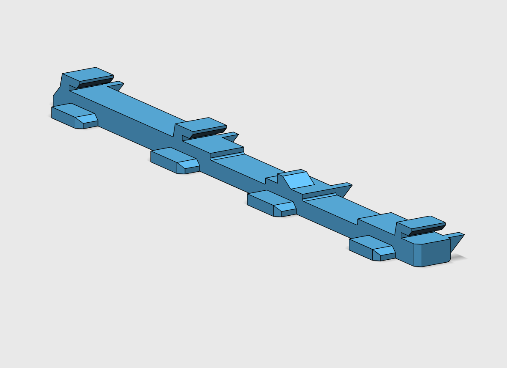
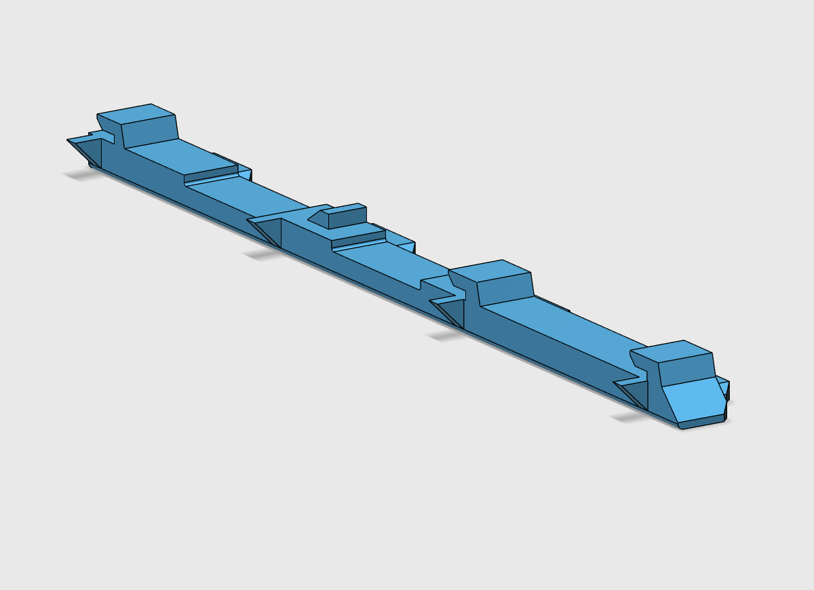
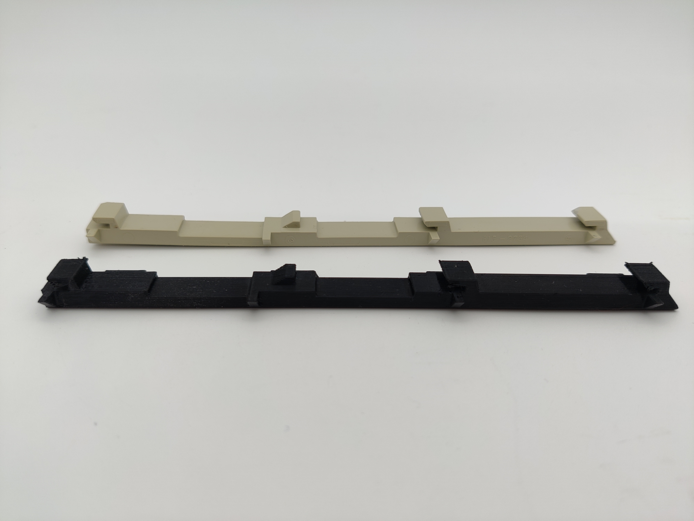
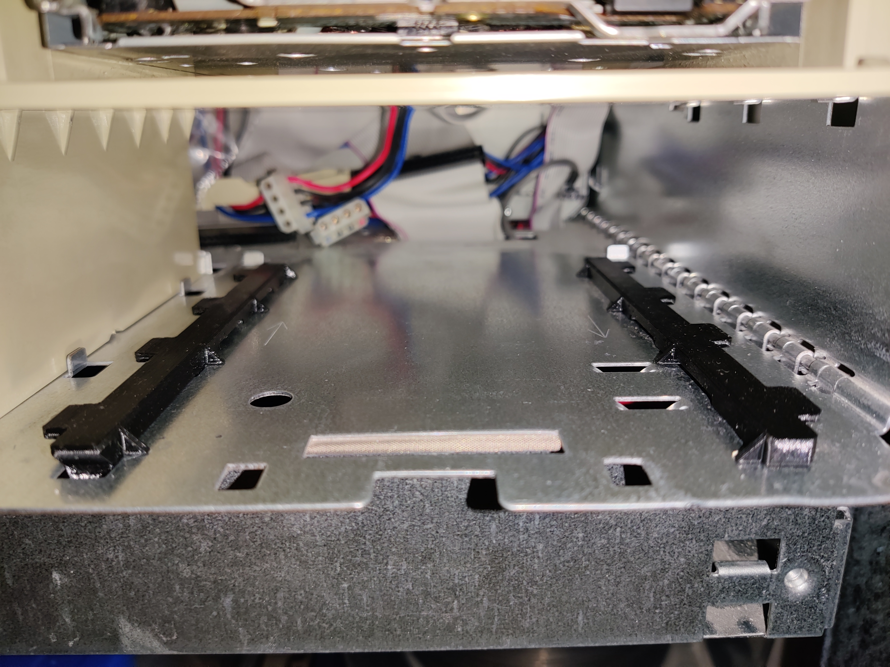

[alxlab GitHub Repositories](https://github.com/alxlab-zone66x?tab=repositories)

# Power Macintosh G3 Drive Rail 922-3228 815-2734

This is the drive rail for the Power Macintosh G3 beige desktop. The Apple part number is 922-3228 and the part is marked with 815-2734. This is used for the CD drive bay and the extra hard drive or zip drive bay.

This drive rail can also replace Apple part number 922-1661 which is marked with 815-1954. This part is used in the Power Macintosh 7200, 7300, 7500, 7600 and WS 7350. In my opinion the G3 drive rail is a superior design since it's easier to slide in the drive.

## 3D Printing Notes

There are two versions of the drive rail 3D model. One is a exact replica of the original drive rail. The other model, with fdm in the filename, is optimized for FDM printers so it will use the least amount of support material and give part strength. I recommend using PETG at a higher temperature for added strength. When using a 0.4mm nozzle make sure to use at least 2 parameter shells, 4 top and bottom layers and at least 15% infill. 

## Pictures

## License

<a property="dct:title"  rel="cc:attributionURL"  href="https://github.com/alxlab-zone66x/Power_Macintosh_G3_Drive_Rail_922-3228_815-2734">Power Macintosh G3 Drive Rail 922-3228 815-2734</a> by <a rel="cc:attributionURL  dct:creator" property="cc:attributionName"  href="https://www.alxlab.com">Alexandre Marcoux</a> is licensed  under <a rel="license" href="http://creativecommons.org/licenses/by-nc/4.0/">Creative Commons Attribution-NonCommercial 4.0 International License</a>

## Community

For more great retro hardware projects and a great community check out:

Join us in #skunkworks on [Discord](https://discord.gg/GKcvtgU7P9) to help make retro solutions available to all.

